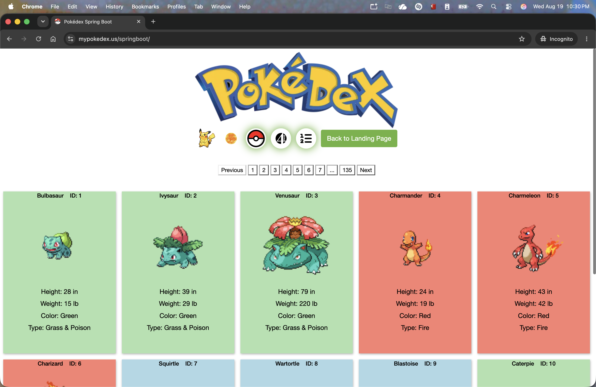

# Pokédex With Spring Boot

# v1.6.5
This version updates the version of Spring Boot. It also applies a fix to the navigation page which was failing to render
the page properly begin of a value going negative. I've applied a fix to prevent a negative value from being used.

# v.1.6.4
This version fixes a bug where the PokeApi client was not returning the data right away. Since we only attempted to call
the client once, nothing was returned. At first, this was yielding a 500 error because we attempted to access data on
a null reference. Later, we updated the code to allow the homepage to load without any data shown. Now, we placed the
call to the client in a while loop. This will continue until the data is returned, allowing the homepage to load with
the Pokemon on the screen, without requiring the user to refresh the page. 

# v1.6.3
This version introduces an update to the navigation section. The inputs have been changed to look just like buttons but
when you hover over them, they will expand and show the input. When you hover out, the input will collapse back in and
hide the input field. This was changed for the Search by Name or ID, Jump to Page, and Pokemon Per Page inputs. The color
you choose from the Landing Page also will be the same color you see on the Go Back to Landing Page button. This color
is also used to highlight the navigation buttons and are seen in the mobile menu. The mobile menu inputs have also been
updated. It is now just the input with the icon inside the input to the right. The Landing Page color is also seen here.
The show gifs and toggle darkmode have also been updated to be a lot more interactive and fun.

# v1.6.2
This version introduces some fixes along with some new CICD features. The deployment is now handled by GitHub Actions.
There are two workflows: a deploy workflow and a revert workflow. Deploy changes and wait for the server to come back
up. If there are any issues preventing the app from showing, the revert workflow can be used to revert the changes back
to the previous version. Once a fix is identified, we can deploy the changes again. Once changes are confirmed to be
working, you're done.

# v1.6.1
This version introduced many GitHub instruction files used to add context for new AI tools introduced recently. There
was also a small fix included which addressed an issue when searching for a particular Pokémon. Now, if a 'name' is
given for a search, we will identify if the name is 'singular' versus 'plural'. So a clear example of a singular name
would be 'pikachu' while in this example, a plural name would be 'dexoys-normal'. Simply put, if there is a dash or space
or any other common word separator, then we will identify it as a plural name. The name is separated into parts, and
each portion will be used to search for a pokemon. The first match will be used to display the Pokémon info. 
This is a small fix, but it ensures that we can search for Pokémon like 'deoxys', the app will return, Deoxys-Normal, and
the user can see the other 'forms' in the family section below the main info page. At least this will not immediately 
fail when a general user makes a search for 'deoxys' and does not know about the various forms of that Pokémon. 

# v1.6.0
This version updates the site according to the v1.6.0 PokedexApi code. There was also a major coordination effort to
ensure this site matched the other flavors of the Pokedex application. This also included an update to how dark mode is
toggled on and off, updates to the mobile version, and various other adjustments to ensure the experience would be
consistent.

# v1.5.0
This version fixes an issue when filtering by type. Now, as the homepage is loaded, the various Pokémon types
are fetched retroactively. There is a cache map containing the types to their list of Pokémon. When a type is selected,
the application checks to see if the type is already cached. If so, the cached list is used. If not, or if the
'pkmnPerPage' value is not yet met in the cache list, then more Pokémon of that type are fetched until we can display
the requested number of Pokémon per page. The process continues until all Pokémon of each type are fetched.

# v1.4.0
This version introduced mobilization to the application. There is now a menu to store the filters when
viewing the list of Pokémon. The menu can be opened and closed with the ellipsis icon. Various other fixes
were resolved with the mobilization effort. The list of Pokémon correctly displays all default information.
When viewing a particular Pokémon, all information is now displayed in a single tile. When viewed on a mobile
device, sections are stacked accordingly. The evolutions section was also revamped to better display the evolution
stages of the selected Pokémon. Finally, various CSS adjustments were made to ensure a better user experience
on mobile devices.

# v1.3.0
This version simply updates the application version to match the corresponding
API code's version. We are skipping v1.2.0.

# v1.1.2
This version fixes a bug when filtering Pokemon by type. While the first set
some particular type do show, the 'totalPokemon' value was not reflecting the
actual number of Pokemon of that type. Now, when a type is chosen, all Pokémon
of that type are fetched. A popup informs the user to wait while we gather all
the Pokémon to display. Once completed, Pokémon of just the selected type are
shown on the page. The results are cached for faster retrieval on subsequent
requests of the same type.

# v1.1.1
This version simply includes some previous jars that were never pushed up.

# v1.1.0
This version added the darkmode value passed in from the new Pokedex Landing
Page. This value is either true or false, darkmode or lightmode respectively.
This value is then passed to all other pages, and the CSS is adjusted
accordingly.

# v1.0.3
This version fixed some issues with description, locations, moves, colors,
and other minor issues found.

# v1.0.2
This version addressed a few minor bugs and improved the user interface
for better usability. Also created the bootable jar file for easier
deployment and confirmed its operability.

# v1.0.0 - v1.0.1
This version integrated with PokedexApi code, removing several duplicate
classes and simplifying the codebase. The PokedexApi library now handles
interactions with the PokeAPI, while the Pokedex application focuses on
the user interface and experience. This change enhances maintainability
and leverages the specialized functionality of the PokedexApi library all
while still maintaining its status of being a 100% Spring Boot application.

# v0.6

Upgraded several major dependencies. Update Parent version reference to 1.0.0,
updated Spring Boot from 3.3.1 to 4.0.0, and Jackson from 2.x to 3.x. Updated
file paths to simplify the structure.

# v0.5

This version introduced the usage of the Parent Pom. This pom manages
all the versions used within the project.

# v0.4

This Spring boot application has been upgraded from 2.7.5 to 3.3.1!

The app begins by listing the Pokemon out in a grid
pattern, defaulting to 10 pokemon per page. On the homepage, there will
be a Pokedex image which directs to the search page. Then there is a
pagination list for all pokemon, a GIF toggle, Jump to Page, and Pokemon
Per Page actions. Finally the list of Pokemon is displayed, followed by
one more pagination option.
If you toggle the GIF button, if a Pokemon has a GIF icon, then that icon
will be displayed instead of the default image. When the GIF toggle is not
enabled, if you hover over the default image, if a Pokemon has an official
icon, then that icon will be displayed instead of the default image.
If you enter a page number to jump to, then providing a value greater than
or equal to 1 and less than or equal to the total page count will load that
page of Pokemon, keeping in alignment with the number of pokemon to view per
page, and if the GIF toggle is on or not.
If you enter a count to display Pokemon Per Page, then as long as that number
is less than or equal to 50, that value will be used. If 51 or more is entered
then the value of 50 will be enforced.
Clicking on a Pokemon box will open more details about that selected Pokemon.
On that info page will list all images available on the Pokemon, various
properties such as height and weight, description, locations, moves, and how
that particular Pokemon evolves, if applicable. Finally, it lists all the
stages of that particular Pokemon. If there are variations of a Pokemon, it
is depicted in the same stage.
Finally, the search page lets you search for a particular Pokemon by its name
or id. If an invalid name or ID is given, then no response will be displayed.
Once a valid name or ID is given, the page will display that Pokemon info.

I have also created a Pull Request for the PokeApi-Reactor code to fix
an issue I encountered. This was previously identified and documented as an
issue on the Github account.
My PR: https://github.com/SirSkaro/pokeapi-reactor/pull/10
The Issue: https://github.com/SirSkaro/pokeapi-reactor/issues/8
Submitted on: June 28th, 2024
Merged in on: July 2nd, 2024

# v<=0.3

This Spring boot application allows you to enter the ID or name of a pokemon
and it will return two images, and details about the Pokemon. If there
is no image available, a pokeball will appear in place of the images.

If the name is mistyped or an ID is not a valid ID for a Pokemon,
an alert will appear.

I am making calls to https://pokeapi.co/docs/v2.
I am utilizing Java (Spring Boot) with auto caching: pokeapi-reactor
written by Benjamin Churchill to create a client.
